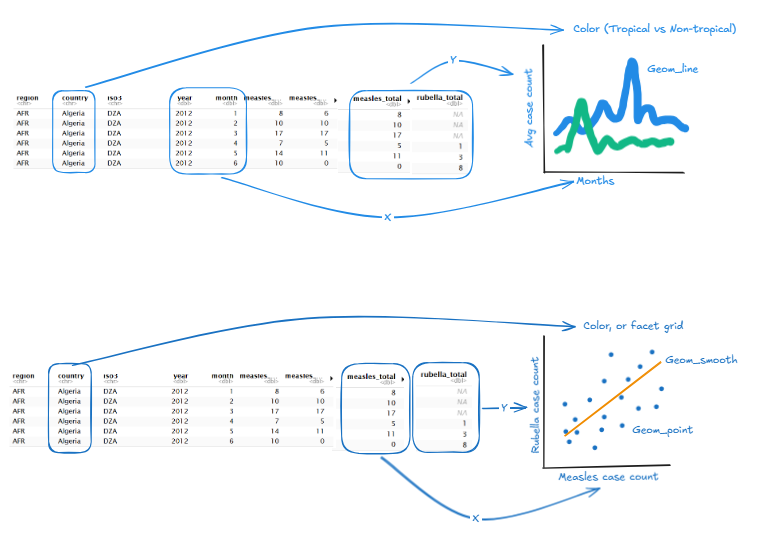

## Measles Cases Analysis

**Dataset**: World Health Organisation (WHO) Provisional Monthly Measles and Rubella Data, downloaded on 2025-06-12.

**Source**: <https://github.com/rfordatascience/tidytuesday/blob/main/data/2025/2025-06-24/readme.md>

**Description**: Monthly and yearly reported measles cases and incidence across countries . As measles continues to become a threat across the world, this data set may provide insight patterns and how outbreaks evolve overtime. The unit of observation is a country's reported case count for a given month or year.

**Data Cleaning**: There are two datasets cleaned in the initial data cleaning. In both datesets, the column names were changed to use snake case. In the month dataset, numerical columns were converted to numeric type. In the year dataset, the first row was removed and converted as the header, and the column names were given more meaningful names.

**Two Research Questions**:

1.  Is there a seasonal pattern in measles and rubella outbreaks and does that pattern differ between tropical and non-tropical countries?
2.  Are rubella and measles outbreaks correlated? Are there countries where one virus remains high while the other is low?




**Two Research Questions with Supplemental Data**

1.  How quickly do measles cases decline after major vaccine distributions and does the speed of decline vary by country income level?
2.  Is there an association between outbreak frequency and education levels?

```{r}
cases_month <- readr::read_csv('https://raw.githubusercontent.com/rfordatascience/tidytuesday/main/data/2025/2025-06-24/cases_month.csv')
cases_year <- readr::read_csv('https://raw.githubusercontent.com/rfordatascience/tidytuesday/main/data/2025/2025-06-24/cases_year.csv')

```

```{r}
head(cases_month)
```

```{r}
head(cases_year)
```

```{r}
str(cases_month)
```
