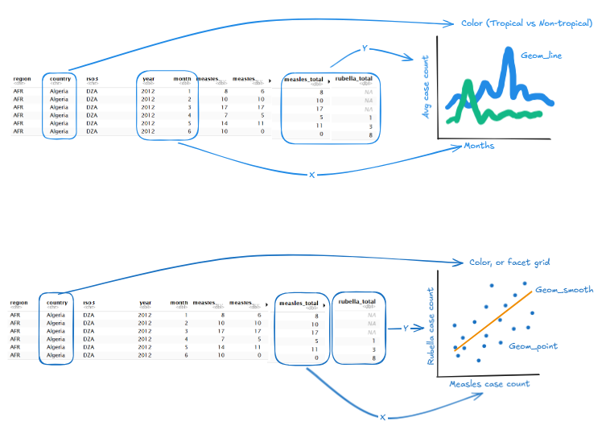

# Measles Cases Analysis

## Checkpoint 1

**Dataset**: World Health Organisation (WHO) Provisional Monthly Measles and Rubella Data, downloaded on 2025-06-12.

**Source**: <https://github.com/rfordatascience/tidytuesday/blob/main/data/2025/2025-06-24/readme.md>

**Description**: Monthly and yearly reported measles cases and incidence across countries . As measles continues to become a threat across the world, this data set may provide insight patterns and how outbreaks evolve overtime. The unit of observation is a country's reported case count for a given month or year.

**Data Cleaning**: There are two datasets cleaned in the initial data cleaning. In both datesets, the column names were changed to use snake case. In the month dataset, numerical columns were converted to numeric type. In the year dataset, the first row was removed and converted as the header, and the column names were given more meaningful names.

**Two Research Questions**:

1.  Is there a seasonal pattern in measles and rubella outbreaks and does that pattern differ between tropical and non-tropical countries?
2.  Are rubella and measles outbreaks correlated? Are there countries where one virus remains high while the other is low?



**Two Research Questions with Supplemental Data**

1.  How quickly do measles cases decline after major vaccine distributions and does the speed of decline vary by country income level?
2.  Is there an association between outbreak frequency and education levels?

```{r}
cases_month <- readr::read_csv('https://raw.githubusercontent.com/rfordatascience/tidytuesday/main/data/2025/2025-06-24/cases_month.csv')
cases_year <- readr::read_csv('https://raw.githubusercontent.com/rfordatascience/tidytuesday/main/data/2025/2025-06-24/cases_year.csv')

```

```{r}
head(cases_month)
```

```{r}
head(cases_year)
```

## Checkpoint 2

```{r}
library(tidyverse)
library(knitr)
```

### How do the lab-confirmed cases of measles in Italy compare across each specific month from 2012 to 2025?

```{r}
monthly_lab_confirmed_measles <- function(country_in) {

  cases_month |> 
    filter(country == country_in) |> 
    group_by(month) |> 
    summarize(total_lab_confirmed = sum(measles_lab_confirmed))

}

monthly_lab_confirmed_measles("Italy") |> 
  mutate(month = case_when(month == 1 ~ "January", 
                           month == 2 ~ "February", 
                           month == 3 ~ "March", 
                           month == 4 ~ "April", 
                           month == 5 ~ "May", 
                           month == 6 ~ "June", 
                           month == 7 ~ "July", 
                           month == 8 ~ "August", 
                           month == 9 ~ "September", 
                           month == 10 ~ "October", 
                           month == 11 ~ "November", 
                           month == 12 ~ "December")) |> 
  kable(col.names = c("Month", "Lab-Confirmed Measles Cases"))
```

### Are measles cases becoming more concentrated in a smaller number of countries over time?

```{r}
#Total global cases per year
global_totals <- cases_year %>%
  group_by(year) %>%
  summarize(global_cases = sum(measles_total, na.rm = TRUE))

#Top 10 countries per year
top10 <- cases_year %>%
  group_by(year) %>%
  arrange(year, desc(measles_total)) %>%
  slice_head(n = 10) %>%
  summarize(top10_cases = sum(measles_total, na.rm = TRUE))

#Concentration
concentration <- left_join(global_totals, top10, by = "year") %>%
  mutate(top10_share = top10_cases / global_cases)

#Plot
ggplot(concentration, aes(x = year, y = top10_share)) +
  geom_line(linewidth = 1) +
  geom_point() +
  labs(
    title = "Concentration of Measles Cases Over Time",
    subtitle = "Share of Global Cases from Top 10 Countries",
    x = "Year",
    y = "Proportion of Global Cases (Top 10 Countries)"
  ) +
  theme_minimal()
```

### How do measles case outcomes differ across regions and years?

```{r}
calc_measles_case_quality <- function(df) {
  df |>
    mutate(
      clinical_rate = measles_clinical / measles_total,
      epi_link_rate = measles_epi_linked / measles_total,
      lab_confirm_rate = measles_lab_confirmed / measles_total
    )
}
```

```{r}

cases_month |>
  calc_measles_case_quality() |>
  group_by(region, year) |>
  summarize(
    avg_clinical_rate = mean(clinical_rate,  na.rm = TRUE),
    avg_epi_link_rate = mean(epi_link_rate, na.rm = TRUE),
    avg_lab_confirm_rate = mean(lab_confirm_rate,  na.rm = TRUE),
    .groups = "drop"
  )
```

### How do typical seasonal patterns of measles cases compare across regions

```{r}

calc_monthly_avg <- function(region_name, df) {
  df |>
    filter(region == region_name) |>
    group_by(month) |>
    summarize(
      avg_measles_total = mean(measles_total, na.rm = TRUE),
      .groups = "drop"
    ) |>
    mutate(
      prop_annual_cases = avg_measles_total / sum(avg_measles_total),
      region = region_name
    )
}

```

```{r}
regions <- cases_month |>
  distinct(region) |>
  pull(region)

monthly_regional_avgs <- regions |>
  map(calc_monthly_avg, df = cases_month) |>
  list_rbind() |>
  arrange(region, month)

monthly_regional_avgs
```

## Checkpoint #3

```{r}
library(httr)
library(tidyjson)
library(jsonlite)
library(glue)

key <- "zfEiGYRkVgqfm6qQzlK3fHJ9HKEC7wMTOmdIGruS"
countries <- unique(cases_year$country)
```

### GDP API

The data set being loaded below came from API Ninjas, and it is the GDP API. It contains historical and current data on the Gross Domestic Product of countries around the world. The columns of the data set represent the growth of GDP, nominal GDP, and purchasing power parity. A few columns also have these variables in terms of per capita.

```{r}

get_country_gdp <- function(cntry) {
  base_url <- "https://api.api-ninjas.com/v1/gdp?"
  url <- glue("{base_url}country={URLencode(cntry, reserved = TRUE)}")
  data <- GET(url, add_headers("X-Api-Key" = key))
  df <- fromJSON(rawToChar(data$content))
  return(df)
}
```

```{r}
#| eval: False
country_gdp <- map(.x = countries,
     .f = ~get_country_gdp(cntry = .x))
```

```{r}
#| eval: False

country_gdp_df <- bind_rows(country_gdp)
```

```{r}
country_gdp_df <- read.csv("country_gdp.csv")
```

This summary analyzes the top 10 and bottom 10 average GDP countries.

```{r}
library(ggplot2)

top_bottom_gdp <- country_gdp_df |>
  group_by(country) |>
  summarize(avg_gdp_per_capita_ppp = mean(gdp_per_capita_ppp, na.rm = TRUE)) |>
  arrange(desc(avg_gdp_per_capita_ppp)) |>
  slice(c(1:10, (n() - 9):n())) |>
  mutate(group = ifelse(row_number() <= 10, "Top 10", "Bottom 10"))

top_bottom_gdp

ggplot(top_bottom_gdp, aes(x = reorder(country, avg_gdp_per_capita_ppp),
                            y = avg_gdp_per_capita_ppp,
                            fill = group)) +
  geom_col() +
  coord_flip() +
  labs(title = "Top and Bottom 10 Countries by Average GDP per Capita (PPP)",
       x = NULL, y = "Avg GDP per Capita PPP", fill = NULL) +
  theme_minimal()
```

### Covid API

The data set being loaded below came from API Ninjas, and it is the Covid-19 API. It contains historical data on Covid-19 cases for every country in the world. Each row is a country and each column is a date (of one single day) and what type of Covid-19 case it is (e.g. total, new cases that day). For example, one of the columns represents the new Covid-19 cases recorded on March 12, 2020. After pulling the data for all countries, we cleaned the set to represent the total number of cases of Covid-19 by month. Instead of each column representing a single day, each column now represents a single month of the given year (e.g. January 2020, August 2023).

```{r}
#| warning: false
#| eval: false

get_country_data <- function(country) {
  if (str_detect(country, " ")) {
    country = str_replace_all(country, " ", "%20")
  }

  base_url <- "https://api.api-ninjas.com/v1/covid19"
  url <- glue("{base_url}?country={country}")

  response <- GET(url, add_headers("X-Api-Key" = key))

  if (status_code(response) != 200) {
    warning(glue("Failed to fetch data for {country}: HTTP {status_code(response)}"))
    return(NULL)
  }

  content <- content(response, as = "text", encoding = "UTF-8")
  parsed <- fromJSON(content, flatten = TRUE)

  if (length(parsed) == 0) {
    warning(glue("No data returned for {country}"))
    return(NULL)
  }

  as.data.frame(parsed)
}
safe_get_country_data <- safely(get_country_data)
country_df <- map(countries, safe_get_country_data) |>
  map("result") |>        # Extract just the result
  compact() |>            # Drop NULLs
  bind_rows()
```

```{r}
#| warning: false
#| eval: false

covid_cleaned_df <- country_df |>
  select(country, region, ends_with(".total")) |>
  group_by(country) |>
  summarise(across(ends_with(".total"), sum, na.rm = TRUE), .groups = "drop") |>
  pivot_longer(
    cols = ends_with(".total"),
    names_to = "date",
    values_to = "cases"
  ) |>
  mutate(month = str_extract(date, "\\d{4}-\\d{2}")) |>
  group_by(country, month) |>
  summarise(cases = max(cases, na.rm = TRUE), .groups = "drop") |>
  pivot_wider(
    names_from = month,
    values_from = cases
  )
```

```{r}
covid_cleaned_df <- read.csv("covid_cleaned.csv")
```

How does the total number of measles cases compare to the total number of Covid-19 cases across countries in 2020?

```{r}
library(scales)

# Total measles cases per country in 2020
measles_2020 <- cases_year |>
  filter(year == 2020) |>
  select(country, measles_total_2020 = measles_total)

# Total Covid-19 cases per country in 2020 (max cumulative value across 2020 months)
covid_2020 <- covid_cleaned_df |>
  select(country, starts_with("X2020")) |>
  rowwise() |>
  mutate(covid_total_2020 = max(c_across(starts_with("X2020")), na.rm = TRUE)) |>
  ungroup() |>
  select(country, covid_total_2020)

# Join, keep top 10 by COVID cases
comparison_2020 <- inner_join(measles_2020, covid_2020, by = "country") |>
  arrange(desc(covid_total_2020)) |>
  slice_head(n = 10)

# Reshape for plotting
comparison_long <- comparison_2020 |>
  pivot_longer(
    cols      = c(measles_total_2020, covid_total_2020),
    names_to  = "disease",
    values_to = "cases"
  ) |>
  mutate(
    disease = case_when(
      disease == "measles_total_2020" ~ "Measles",
      disease == "covid_total_2020"   ~ "COVID-19"
    ),
    country = fct_reorder(country, cases, .fun = max)
  )

ggplot(comparison_long, aes(y = country, x = cases, fill = disease)) +
  geom_col(
    position = position_dodge(width = 0.75),
    width    = 0.65
  ) +
  scale_x_log10(
    labels = label_number(scale_cut = cut_short_scale()),
    breaks = 10^(0:8)
  ) +
  scale_fill_manual(values = c("COVID-19" = "#D85A30", "Measles" = "#1D9E75")) +
  labs(
    title    = "Measles vs. COVID-19 Cases in 2020",
    subtitle = "Top 10 countries by COVID-19 case count — log scale",
    x        = "Total Cases (log scale)",
    y        = NULL,
    fill     = NULL
  ) +
  theme_minimal(base_size = 12) +
  theme(
    legend.position    = "top",
    panel.grid.major.y = element_blank(),
    panel.grid.minor   = element_blank(),
    axis.text.y        = element_text(size = 10)
  )
```

### Meta Dataset

```{r}
join1 <- left_join(cases_year, covid_cleaned_df, by = join_by(country))
```

```{r}
country_gdp_df <- country_gdp_df |> 
  rename(country_code = country)
join1 <- join1 |> 
  rename(country_code = iso3)
```

```{r}
all_data_joined <- left_join(join1, country_gdp_df, by = join_by(country_code))
```

```{r}
head(all_data_joined)
```

## Checkpoint #4

### Visualizations

```{r}
#| echo: false
#| output: false

library(ggridges)

covid_longer <- covid_cleaned_df |>
  pivot_longer(cols = -country,
               names_to = "year",
               values_to = "count") |>
  mutate(month = str_extract(year, "\\d{2}$"),
         year = str_remove_all(year, "X"),
         year = str_remove(year, "\\.\\d*$"),
         year = as.numeric(year),
         month = as.numeric(month),
         iso3 = countrycode::countrycode(country, 
                                         origin = "country.name", 
                                         destination = "iso3c")) |>
  rename(covid_count = count)

covid_measles <- left_join(covid_longer, 
          cases_month, 
          by = c("iso3","year","month"))
```

```{r}
#| echo: false
#| output: false


t <- unique(cases_month$country) |> head(10)
cases_month |>
  filter(country == t) |>
  group_by(country, year) |>
  ggplot(aes(x = measles_total, 
             y = country)) +
  geom_density_ridges()

# measles_total
```

```{r}
#| echo: false
#| output: false

unique(covid_longer$country) |> sort()
```

```{r}
#| echo: false
#| output: false

covid_measles |>
  filter(region == "AMR") |>
  # Replace 0s with NA so log scale drops them cleanly instead of warning
  mutate(
    measles_total = na_if(measles_total, 0),
    covid_count   = na_if(covid_count, 0),
    total_burden  = measles_total + covid_count
  ) |>
  mutate(date = as.Date(paste(year, month, "01", sep = "-"))) |>
  ggplot(aes(x = date)) +
  geom_line(aes(y = measles_total, color = "Measles")) +
  geom_line(aes(y = covid_count, color = "COVID")) +
  geom_ribbon(aes(ymin = measles_total, 
                  ymax = total_burden, 
                  fill = "COVID excess"),
              alpha = 0.4, na.rm = TRUE) +
  geom_line(aes(y = measles_total, color = "Measles baseline"), na.rm = TRUE) +
  facet_wrap(~region) +
  scale_y_log10(labels = scales::label_comma()) +
  labs(title = "Disease burden: measles vs. COVID overlay by region")
```

```{r}
#| echo: false
#| output: false

covid_measles |>
  mutate(
    measles_total = na_if(measles_total, 0),
    covid_count   = na_if(covid_count, 0),
    total_burden  = measles_total + covid_count
  ) |>
  filter(is.na(covid_count))
```

This lollipop plot visualizes the spread of total measles cases across the world by year. The peak in this graph is occurring at 2019. In the final report, we will explore further why this peak is happening and if there is a specific country that is responsible.

```{r}
#| fig-alt: "Lollipop plot showing the total number of measles cases in all countries by year.  Most years have similar totals, however there is a significant peak in 2019."

global_totals <- cases_month |> 
  group_by(year) |> 
  summarize(total_cases = sum(measles_total, na.rm = TRUE))

ggplot(global_totals, aes(x = year, y = total_cases)) + 
  geom_segment(aes(yend = 0, 
                   xend = year), 
               color = "purple2") + 
  geom_point(size = 4, color = "purple4") + 
  scale_y_continuous(labels = function(x) format(x, scientific = FALSE)) +
  theme_minimal() + 
  labs(x = "Year", y = "Total Cases", 
       title = "Measles Cases Across the World Over Time", 
       subtitle = "Total Count of Global Cases by Year")
```

How does the total number of measles cases compare to the total number of Covid-19 cases across countries in 2020?

```{r}
#| fig-alt: "Horizontal bar graph comparing Covid-19 and measles cases in the 10 countries with the highest count of Covid-19 cases. Covid-19 cases significantly outnumber the measles cases."

measles_2020 <- cases_year |>
  filter(year == 2020) |>
  select(country, measles_total_2020 = measles_total)

covid_2020 <- covid_cleaned_df |>
  select(country, starts_with("X2020")) |>
  rowwise() |>
  mutate(covid_total_2020 = max(c_across(starts_with("X2020")), 
                                na.rm = TRUE)) |>
  ungroup() |>
  select(country, covid_total_2020)

comparison_2020 <- inner_join(measles_2020, covid_2020, by = "country") |>
  arrange(desc(covid_total_2020)) |>
  slice_head(n = 10) |>
  pivot_longer(cols = c(measles_total_2020, covid_total_2020), 
               names_to = "disease", values_to = "cases") |>
  mutate(disease = case_when(disease == "measles_total_2020" ~ "Measles", 
                             disease == "covid_total_2020"   ~ "COVID-19"), 
         country = fct_reorder(country, cases, .fun = max))

ggplot(comparison_long, aes(y = country, x = cases, fill = disease)) +
  geom_col(position = position_dodge(width = 0.75), width = 0.65) +
  scale_x_log10(labels = label_number(scale_cut = cut_short_scale()), 
                breaks = 10^(0:8)) +
  scale_fill_manual(values = c("COVID-19" = "#D85A30", 
                               "Measles" = "#1D9E75")) +
  labs(title    = "Measles vs. COVID-19 Cases in 2020", 
       subtitle = "Top 10 countries by COVID-19 case count — log scale",
       x = "Total Cases (log scale)", y = NULL, fill = NULL) +
  theme_minimal(base_size = 12) +
  theme(legend.position = "top", panel.grid.major.y = element_blank(), 
        panel.grid.minor = element_blank(), 
        axis.text.y = element_text(size = 10))
```

### Statistical Model

**Research Question**: Is there a significant difference in mean GDP growth between countries with high versus low measles burden in 2019?

-   Null Hypothesis: There is no difference in mean GPD growth between high and low measles burden countries in 2019

-   Alternative Hypothesis: There is a difference in mean GDP growth between high and low measles burden countries in 2019

```{r}

cases_gdp_join <- inner_join(cases_year, country_gdp_df, 
                             by = join_by(year, iso3 == country_code)) |>
  mutate(
      high_measles = measles_lab_confirmed > median(measles_lab_confirmed)
      ) |>
  filter(year == 2019)
```

```{r}

t.test(gdp_growth ~ high_measles, data = cases_gdp_join)
```

**Conclusion**: Using the 2019 data, a year marked by a notable rise in measles cases, countries were classified as high measles burden if their lab-confirmed measles cases exceeded the median of 48 cases. A two sample t-test resulted in no significant difference in mean GDP growth between countries with high and low measles burden. Due to a t-value = -1.04 and a p-value = 0.299 \> alpha = 0.05, we fail to reject the null hypothesis.
